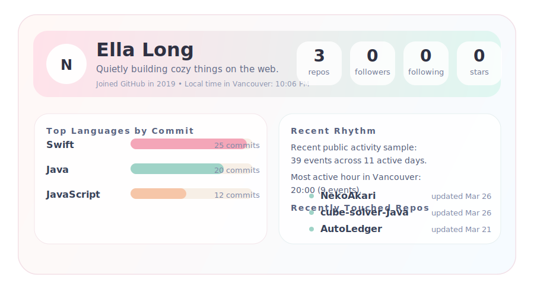

# NekoAkari

### Computing Science student at SFU, building practical projects with code and design

---

## About Me

- Computing Science student at Simon Fraser University
- Interested in software development, UI/UX, and practical projects
- Building with Java, SwiftUI, front-end development, testing, and software design
- Drawn to projects that feel both functional and well-designed
- Curious about how technology, design, and usability connect together
- Outside of coding: photography, movies, games, and learning guitar

---

## GitHub Pulse

  a tiny snapshot of what I'm usually building around here

  

  <!-- LAST_UPDATED:START -->
Last updated: 2026-04-06, 11:38:50 (Vancouver time)
<!-- LAST_UPDATED:END -->

---

## Languages

  
  
  
  
  

---

## Toolbox

  
  
  
  
  
  
  

---

  ｡･:*:･ﾟ★,｡･:*:･ﾟ☆  thanks for stopping by  ☆･ﾟ:*:･｡,★･ﾟ:*:･｡

<!--
**NekoAkari/NekoAkari** is a special repository because its `README.md` appears on the GitHub profile page.
-->
